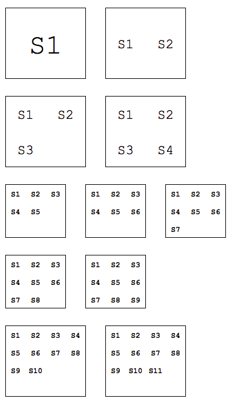
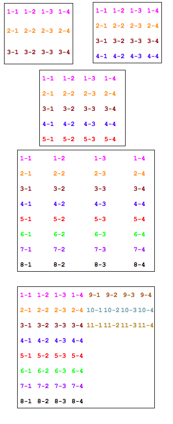

## Need

```gherkin
As a user
I want my data to be laid out in the best way possible
So that I can quickly understand it.
```


## Deliverables

We are given a list of items. Each item belongs to a stack. We want to position
these items in an N*N grid and minimize N. In order to do this, we will put each
stack on a separate row and only use another column when we have enough room. We
won't create another column if doing so would increase the size of the grid.
Check the pictures below to better understand this behavior.


Stacks that only have a single item:




Stacks with multiple items:




## Solution

Implement your solution in the [src/grid.js](src/grid.js) file. Read the
docstrings in there to get a better idea of what you need to do. Feel free to
install any other package you find useful, but make sure you save it as a
dependency in [package.json]().


#### Setup

Make sure you have [node](https://nodejs.org/download/) and
[npm](https://docs.npmjs.com/getting-started/installing-node) installed and run
`npm install` to install the dependencies necessary for this project.


#### Testing

To run the tests use `npm test`. The tests are written using
[mocha](http://mochajs.org/) and [chai](http://chaijs.com/).


#### Grading

You will be graded on the number of tests that pass and on the quality (code
style, performance, use of best practices etc.) of your code.
